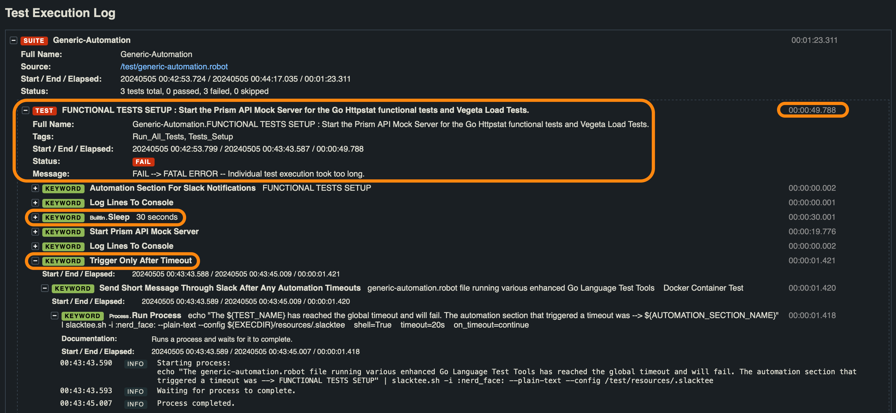
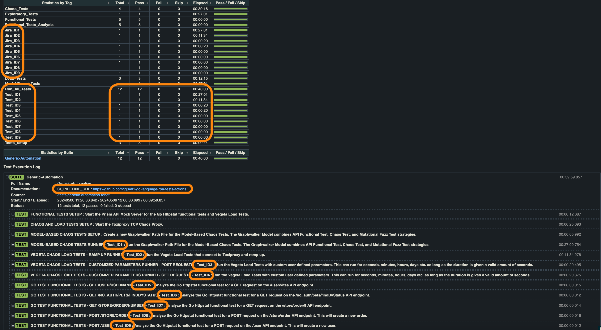

# go-language-rpa-tests

[](https://github.com/jg8481/go-language-rpa-tests/actions/workflows/toolkit-checks.yaml)


## Go Language test tools enhanced with RPA

**"All testers do exploratory testing. Some do it more deliberately and in intentionally skilled ways." - [Cem Kaner](https://13j276.p3cdn1.secureserver.net/pdfs/QAIExploring.pdf)**

**"Are you doing testing? Then you are already doing exploratory testing. Are you doing scripted testing? If you’re doing it responsibly, you are doing exploratory testing with scripting (and perhaps with checking)." - [James Bach](https://www.satisfice.com/blog/archives/1509)**

`Go Language` by itself is [a powerful and high-performance language built for scalability](https://go.dev/solutions/case-studies). It has many libraries that can be used to create automation, but there are some exploratory test strategies that can be more easily implemented (with less lines of code) using a `generic RPA framework` to complement the strengths of Go. For example, the following strategies are not easy to quickly create within a day or two using only pure Go Language code.
- [Model-Based Tests using Graphwalker's visual .graphml files](https://graphwalker.github.io/), combined with Chaos Tests
- Load Tests combined with Chaos Tests 
- Mutational Fuzz Tests combined with Model-Based Tests 
- Slack-bots that report failures on all of the above
- Listener Interface that monitors every test and performs actions during runtime

This repository is a `collection of Go Language test tools` and strategies [enhanced with Robot Framework](https://robotframework.org/), an open source RPA (Robotic Process Automation) and generic automation framework. The goal is to demonstrate how these two sides can work together to form a more powerful test strategy than just one side by itself. Here is a list of the Go Language tools and components that are being utilized. The examples utilizing these components and tools can also be used without RPA for hands-on exploratory testing.
- [go test](https://pkg.go.dev/testing), the built-in Go Language test tool
- [httpstat](https://github.com/davecheney/httpstat) and [go-httpstat](https://github.com/tcnksm/go-httpstat), a Go Language tool and library (similar to `curl`) that gathers various metrics of HTTP requests 
- [vegeta](https://github.com/tsenart/vegeta), a versatile and customizable HTTP load testing tool and library
- [toxiproxy](https://github.com/Shopify/toxiproxy), a TCP Chaos Proxy tool

### Toolkit Roadmap 

In the future I plan to expand this toolkit into the following areas.
- Experiment with the [f1](https://github.com/form3tech-oss/f1) performance test framework. Try to create some examples.
- Experiment with the [robotgo](https://github.com/go-vgo/robotgo) cross-platform GUI automation framework. Try to create some examples.
- Experiment with the [py4go](https://github.com/tliron/py4go) project. Try to create some examples.

## Quick Walkthrough

All of the examples in this repository are designed to run within a Docker container. It is the only requirement to run everything explained below in this walkthrough section. The following documentation can be used to install Docker.
- https://docs.docker.com/get-docker/


### [Test Target + Setup] Prism + Toxiproxy

Most of the tests will be targeting a `prism` mock API server through a TCP Chaos Proxy called `toxiproxy`, the rest of the tests (Functional Tests specifically) will be targeting the `prism` server directly. The `generic-automation.robot` file (combined with the `ToxiproxyChaosTestLibrary.py` and `PrismMockServerLibrary.py` RPA automation libraries) manages the setup and teardown of these tools. The documentation links below provide more details.
- https://github.com/stoplightio/prism/tree/master/docs/getting-started
- https://github.com/Shopify/toxiproxy?tab=readme-ov-file#usage

The `generic-automation.robot` file uses the `ToxiproxyChaosTestLibrary.py` to create an `exploratory-testing-proxy` that will concurrently run the following "toxics". In `toxiproxy` a "toxic" is the [Chaos Testing mechanism](https://principlesofchaos.org/) that is challenging the server's resilience by simulating real-world network problems.
- [latency](https://github.com/Shopify/toxiproxy?tab=readme-ov-file#latency)
- [bandwidth](https://github.com/Shopify/toxiproxy?tab=readme-ov-file#bandwidth)
- [slow_close](https://github.com/Shopify/toxiproxy?tab=readme-ov-file#slow_close)

### [Functional Tests] Go Test + HTTPStat

The Functional Tests are handled by the `functional-tests_test.go` and `httpstat-test-runner.go` files. For MacOS and Linux users, you can run these tests with the following command from a terminal.
- `bash ./run-go-rpa-tests.sh Run-Specific-Tests-Inside-Docker Start-Go-Language-Functional-Tests`

Windows users can run the following commands.
- `docker-compose -f docker-compose.yml build`
- `docker-compose run docker-test-runner run-go-rpa-tests.sh Start-Go-Language-Functional-Tests`

The results of the `go test` runner is set to provide JSON output. The following script can analyze the JSON results and generate clearer results in an HTML log file.
- `bash ./run-go-rpa-tests.sh Run-Specific-Tests-Inside-Docker Analyze-Functional-Tests-Generate-HTML-Logs`

Optionally, the `httpstat-test-runner.go` file can be used for hands-on exploratory testing using the following commands. 
- (MacOS/Linux users) `bash ./run-go-rpa-tests.sh Run-Specific-Tests-Inside-Docker Manual-Scripted-Tests-In-Docker`
- (Windows users) `docker-compose -f docker-compose.yml build`, then run `docker-compose run docker-test-runner run-go-rpa-tests.sh Manual-Scripted-Tests-In-Docker`

### [Load Tests] Vegeta + Toxiproxy

The Load Tests are handled by the `vegeta-load-test-runner.go` and `VegetaLoadTestLibrary.py` files. The script below runs two types of Load Tests, (1) a ramp-up load test runner and (2) a cusomizable load test runner. All of the Load Tests go through `toxiproxy` first before reaching the `prism` mock server.
- `bash ./run-go-rpa-tests.sh Run-Specific-Tests-Inside-Docker Start-Chaos-Proxy-Load-Tests`

Windows users can run the following commands.
- `docker-compose -f docker-compose.yml build`
- `docker-compose run docker-test-runner run-go-rpa-tests.sh Start-Chaos-Proxy-Load-Tests`

### [Model-based Tests] Graphwalker + Radamsa + Toxiproxy

The Model-based Tests are handled by the `generic-automation.robot` and `GraphwalkerModel.graphml` files. In addition to the `toxiproxy` Chaos Proxy automation mentioned above, the Graphwalker Model-based Tests displayed in the screenshot below use the `httpstat-test-runner.go` file and a Mutational Fuzzer called [Radamsa](https://gitlab.com/akihe/radamsa).


For MacOS and Linux users, you can run these Model-based Tests with the following command from a terminal.
- `bash ./run-go-rpa-tests.sh Run-Specific-Tests-Inside-Docker Start-Graphwalker-Model-Based-Tests`

Windows users can run the following commands.
- `docker-compose -f docker-compose.yml build`
- `docker-compose run docker-test-runner run-go-rpa-tests.sh Start-Graphwalker-Model-Based-Tests`

More information about Model-based Testing can be found in the links below.
- https://graphwalker.github.io/#articles
- https://www.harryrobinson.net/
- https://testoptimal.com/ref/starwest-2006-mbt-tutorial.pdf

### [RPA Bonus Features] Slack-bot + Listener Interface + Combined Test Metrics Results

The Slack-bot is a part of the `generic-automation.robot` file, and will send a Slack message using [slacktee](https://github.com/coursehero/slacktee) when any tests fail. The screenshots below demonstrate how a Model-based Test failure is sent to a specific Slack channel.


The `DurationTrackingListener.py` uses the Robot Framework Listener Interface to monitor the execution of all tests. Robot Framework's Listener Interface has many capapbilities, more details about it can be found in the links below.
- https://robotframework.org/robotframework/latest/RobotFrameworkUserGuide.html#listener-interface
- https://www.youtube.com/watch?v=lKu-9WKtYcg

When the `DurationTrackingListener.py` is set to a very low number (for example, `max_seconds=1`) this will very easily show the test monitoring capabilities of an RPA framework. The screenshots below demonstrate what happens when I added a 30 second delay.




Another useful side-effect of having the `generic-automation.robot` file act as an overseer of all tests is that it can combine the results of all tests into a single HTML log file. This is useful for a quick overview of all test results in one place. The screenshot of the `combined-test-results-log.html` below demonstrates this feature.



### [Automation Workflows] Tool Runner Script Options

The `run-go-rpa-tests.sh` script is a tool runner script that can run all of the above workflows in a Docker container. The script has the following options for running on a local work station or in GitHub Actions CI.

```
You can view a help menu (without triggering any automation) by running 'bash ./run-go-rpa-tests.sh -h' or 'bash ./run-go-rpa-tests.sh --help'

bash ./run-go-rpa-tests.sh Stop-Containers-And-Build-Docker-Container-With-Compose
bash ./run-go-rpa-tests.sh Run-Specific-Tests-Inside-Docker Start-Go-Language-Functional-Tests
bash ./run-go-rpa-tests.sh Run-Specific-Tests-Inside-Docker Start-Chaos-Proxy-Model-Based-Tests
bash ./run-go-rpa-tests.sh Run-Specific-Tests-Inside-Docker Start-Chaos-Proxy-Load-Tests
bash ./run-go-rpa-tests.sh Run-Specific-Tests-Inside-Docker Analyze-Functional-Tests-Generate-HTML-Logs
bash ./run-go-rpa-tests.sh Run-Specific-Tests-Inside-Docker Start-All-Tests
bash ./run-go-rpa-tests.sh Run-Specific-Tests-Inside-Docker Manual-Scripted-Tests-In-Docker
```
